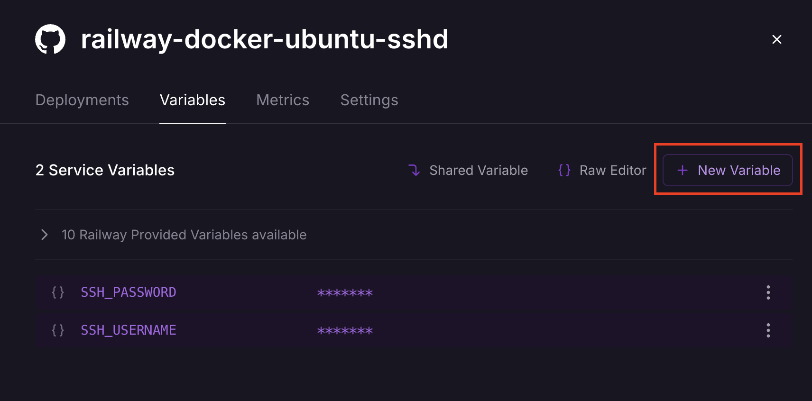
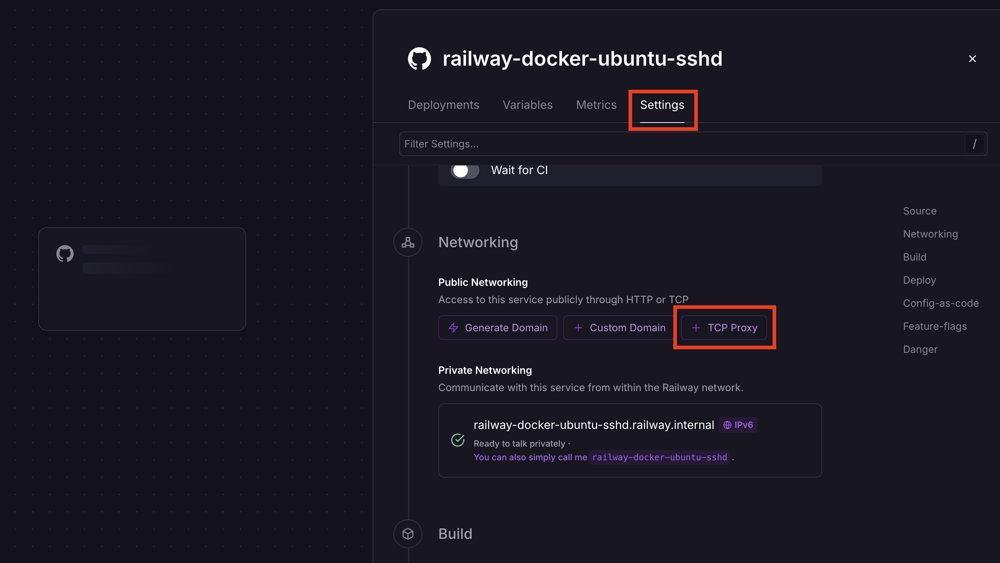
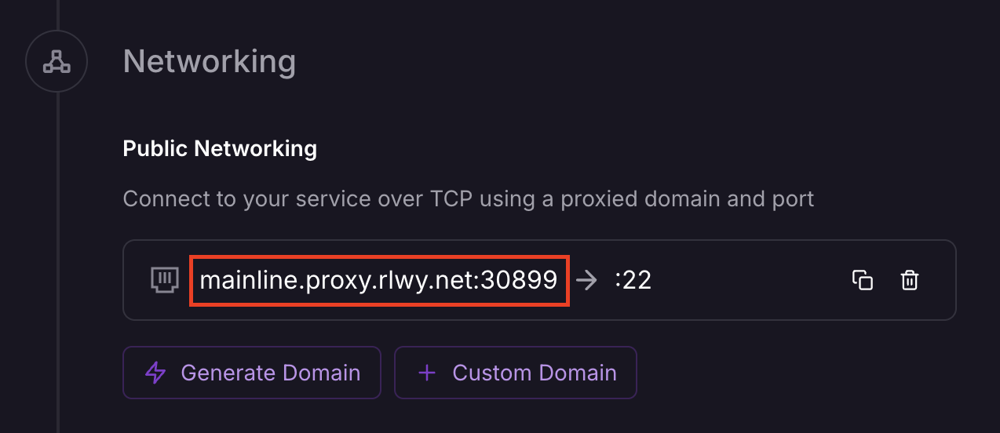

# Railway Docker Ubuntu SSH Server

A Docker image designed for Railway deployment that provides an Ubuntu 22.04 base with SSH server enabled (SSHD). This allows you to connect to your Railway container via SSH for remote access and management.

## Features

- Ubuntu 22.04 base image
- SSH server (OpenSSH) pre-configured
- **Clean SSH Login**: No welcome messages for direct command line access
- Password authentication enabled
- Root login disabled by default for security
- Created user has sudo permissions
- Network utilities included (ping, telnet, iproute2)
- **Development Environment**: Claude Code, Node.js 18+, Ruby 3.2, Rails
- **CLI Tools**: GitHub CLI, Railway CLI, PostgreSQL client, Redis tools
- **Package Managers**: npm, pnpm, yarn, bundler
- **Automated setup**: Git configuration, CLI authentication, repository cloning

## ⚠️ Important Notice

**Railway runs Docker containers, not VPS!** Any data stored in the container will be **lost when redeploying**. This includes:
- Files created after deployment
- Installed packages
- Configuration changes
- User data

If you need persistent storage, consider using Railway's volume mounts or external storage solutions.

## Setup Instructions

### STEP 1: Configure SSH Credentials


#### Option 1: Modify ssh-user-config.sh

1. **Before deploying**, edit the `ssh-user-config.sh` file and change the default values:

   ```bash
   # Change these default values to your desired credentials
   : ${SSH_USERNAME:="myuser"}
   : ${SSH_PASSWORD:="mypassword"}
   ```

2. Commit and push your changes to your repository

3. **Then** deploy to Railway

#### Option 2: Use Railway Environment Variables

1. **Deploy** to Railway
2. Go to your project dashboard
3. Navigate to **Settings** → **Variables**:

   

4. Add the following environment variables:

   **SSH Configuration:**
   - `SSH_USERNAME` - Your desired username
   - `SSH_PASSWORD` - Your desired password
   - `ROOT_PASSWORD` - Root password (optional, leave empty if root login is disabled)
   - `AUTHORIZED_KEYS` - SSH public keys for key-based authentication (optional)

   **Development Environment (Optional):**
   - `GH_TOKEN` - GitHub Personal Access Token for GitHub CLI authentication
   - `GITHUB_EMAIL` - Your git commit email address
   - `GITHUB_NAME` - Your git commit name
   - `RAILWAY_TOKEN` - Railway API token (optional, for CI/CD use)

5. Redeploy your project to apply the new environment variables:

   

### STEP 2: Configure TCP Proxy

1. Go to your Railway project dashboard
2. Navigate to **Settings** → **Networking**:

   

3. Under **Public Networking**, click **TCP Proxy**
4. Enter the exposed port `22` (the default SSH port):

   

5. Click **Add Proxy**

### STEP 3: Redeploy the Project

After configuring the TCP proxy, redeploy your project to apply the networking changes:


### STEP 4: Connect via SSH

1. Once deployed, Railway will provide you with a domain and port for TCP access:

   

2. Use the SSH command to connect:
   ```bash
   ssh {username}@{domain} -p {port}
   ```
   Example:
   ```bash
   ssh myuser@mainline.proxy.rlwy.net -p 30899
   ```

3. When prompted about the host authenticity, type `yes` to accept the new key pair
4. Enter the user password when prompted
5. You're now connected to your Railway container via SSH!

## Development Environment

This container comes pre-configured with a complete development environment including:

### Installed Tools
- **Claude Code**: AI-powered development assistant
- **Node.js 18+**: JavaScript runtime with npm, pnpm, and yarn
- **Ruby**: System Ruby with Rails and bundler pre-installed
- **GitHub CLI**: Authenticated and ready to use (if `GH_TOKEN` provided)
- **Railway CLI**: Available (requires `railway login --browserless` in SSH session)
- **Database Clients**: PostgreSQL and Redis clients
- **Build Tools**: ripgrep, build-essential, git, curl, wget

### Automatic Setup
When the container starts, it automatically:
1. Configures git with your identity (if `GITHUB_EMAIL` and `GITHUB_NAME` provided)
2. Authenticates GitHub CLI (if `GH_TOKEN` provided)
3. Installs Railway CLI (login required: `railway login --browserless`)  
4. Installs Claude Code globally for the SSH user
5. Creates a `~/dev/` directory for your projects

### Clean Login
SSH login goes directly to command prompt with no welcome messages for a clean development experience.

### Usage
After SSH connection:
```bash
# Claude Code is ready to use
claude

# GitHub CLI is authenticated
gh repo list

# Railway CLI (requires manual login in SSH session)
railway login --browserless
railway list

# Clone your repos to ~/dev/
cd ~/dev
gh repo clone owner/repo

# Ruby and Rails are ready
ruby --version
rails --version

# Node.js tools are ready
node --version
npm --version
pnpm --version
```

## Configuration Details

### Default Values

The current default values in `ssh-user-config.sh` are:
- `SSH_USERNAME=myuser`
- `SSH_PASSWORD=mypassword`

**⚠️ Important:** Change default values before deploying to production.

### Environment Variable Priority

The system checks for credentials in this order:
1. Railway environment variables (highest priority)
2. Values set directly in `ssh-user-config.sh` (default if no environment variables)

### Root Access

Root login is **disabled by default** for security reasons. If you need to enable root login, you can modify the Dockerfile by changing:

```dockerfile
&& echo "PermitRootLogin no" >> /etc/ssh/sshd_config
```

to:

```dockerfile
&& echo "PermitRootLogin yes" >> /etc/ssh/sshd_config
```

**Note:** The created user already has sudo permissions and is added to the sudo group, so root access is typically unnecessary.

## Security Considerations

- **CRITICAL:** Always change the default SSH credentials in `ssh-user-config.sh` before deploying to production
- Root login is disabled by default
- Only password authentication is enabled by default
- The default user has sudo privileges for administrative tasks
- Consider using SSH keys (`AUTHORIZED_KEYS`) instead of passwords for better security
- When using `AUTHORIZED_KEYS`, password authentication is automatically disabled

## Container Limitations

- **No persistent storage:** All data is lost when redeploying.
- **Not a VPS:** This is a containerized environment, not a virtual private server
- **Temporary file system:** Any files created inside the image will be lost on restart/redeploy

**Important:** Conside using **Railway Volume Mount** for persistent storage

## Troubleshooting

- Ensure the TCP proxy is configured correctly on Railway
- Verify the correct domain and port are being used
- Check that the container is running and healthy
- Confirm firewall settings allow SSH connections
- Verify credentials are set correctly in `ssh-user-config.sh` or Railway environment variables
- Remember that data loss occurs on every redeploy

## License

This project is licensed under the terms included in the LICENSE file.
